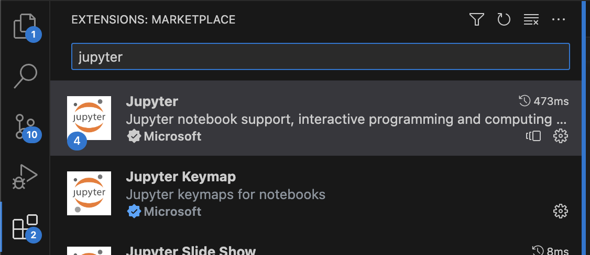
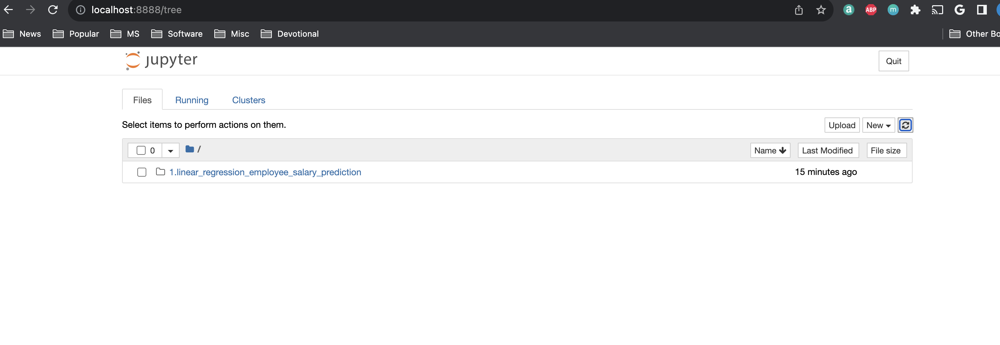

# Introduction to Machine Learning using Docker and AWS Sagemaker

This repository created to learn Machine Learning concepts over Docker and also using AWS Sagemaker. The Dockerfile builds image for the below frequently software ideal for Data Science and Machine Learning:
 - NumPy
 - Pandas
 - Scikit-Learn
 - Scikit-Image
 - Matplotlib
 - Seaborn
 - pyyaml
 - h5py
 - Jupyter
 - Tensorflow
 - Keras
 - OpenCV 3
 - OpenJDK

We would be building this container on top of [Ubuntu latest LTS Docker container](https://hub.docker.com/_/ubuntu/) 

## Pre-requisites to run the container locally
0. Install [VS Code](https://code.visualstudio.com/download) and install Jupyter extension from within the VS Code IDE as shown below

1. Install [Docker Desktop](https://www.docker.com/products/docker-desktop/) locally
2. Install [Git](https://git-scm.com/downloads) locally for Windows users
3. Launch gitbash shell (windows) OR any shell (Linux/MacOS) 
4. Ensure Docker Daemon is running either from Windows Task Manager or
```sh
systemctl status docker
OR
pgrep -f docker > /dev/null || echo "starting docker"
OR
cat /var/run/docker.pid 
```
5. Clone the code from git (Optional)
```sh
mkdir <Project_Path>
git clone https://github.com/asreenath/aws_ml_certification.git .
```

## Building the docker container image (Optional)

If you want to build the image locally

```sh
cd <Project_Path>
docker build . -t aws_ml:latest
```

## Running the container

We'll use ```notebooks``` forlder to store Jupyter Notebooks:
```sh
mkdir notebooks
```

Run Docker container with the following command:

If you built your image locally using the build step above ->
```sh
docker run -it -p 8888:8888 -p 6006:6006 -d -v $(pwd)/notebooks:/notebooks aws_ml
```

If you want use pre-built image from Docker hub ->
```sh
docker run -it -p 8888:8888 -p 6006:6006 -d -v $(pwd)/notebooks:/notebooks asreenath/aws_ml
```


We're using following parameters:
- ```-p 8888:8888``` to export Jupyter Web interface
- ```-p 6006:6006``` to export TensorflowDashboard Web interface
- ```-d``` to run Docker container in background
- ```-v notebooks:/notebooks``` to mount just created *notebooks* folder Docker inside container

Verify the container is running. The status column must show "Up" for the Image "aws_ml"
```sh
docker ps -a
```

## Using Jupyter running inside the container

1. Open http://localhost:8888 in your favorite browser to open Juypter


        
                            OR

2. Attach a Python Kernel to a Jupyter notebook. Configure the notebook to use your Jupyter running in your Docker at http://localhost:8888


# Learning Data Science ML Algorithms using Jupyter notebooks

### General References -

1. [General Machine Learning Concepts](https://www.geeksforgeeks.org/100-days-of-machine-learning/)
2. [Sample Jupyter notebooks from Library basics to ML techniques](https://machine-learning-with-python.readthedocs.io/)
<br/>

### Linear Regression -
<br/>
Linear regression is a type of supervised machine learning algorithm that computes the linear relationship between a dependent variable and one or more independent features. When the number of the independent feature, is 1 then it is known as Univariate Linear regression, and in the case of more than one feature, it is known as multivariate linear regression. The goal of the algorithm is to find the best linear equation that can predict the value of the dependent variable based on the independent variables. The equation provides a straight line that represents the relationship between the dependent and independent variables. 

<br/>
Resources - 

Use the resources in <b>"linear_regression_employee_salary_prediction"</b> folder. Using Jupyter notebook open the file "employee_salary_prediction_notebook.ipynb" 

<br/>
References - 

a. [Linear Regression Concept](https://www.geeksforgeeks.org/ml-linear-regression/)\
b. [Linear Learner Alogirthm in Sagemaker](https://docs.aws.amazon.com/sagemaker/latest/dg/linear-learner.html) 

