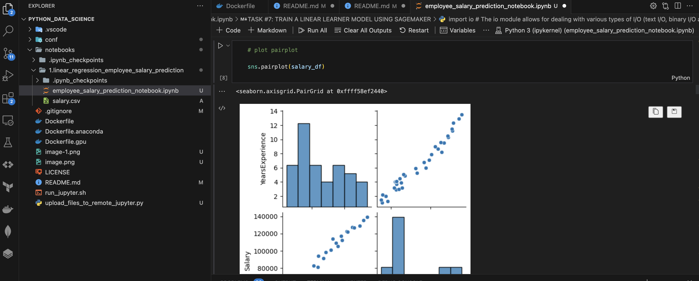

# Introduction to Machine Learning using Docker and AWS Sagemaker

This repository created to learn Machine Learning concepts over Docker and also using AWS Sagemaker. The Dockerfile builds image for the below frequently software ideal for Data Science and Machine Learning:
 - NumPy
 - Pandas
 - Scikit-Learn
 - Scikit-Image
 - Matplotlib
 - Seaborn
 - pyyaml
 - h5py
 - Jupyter
 - Tensorflow
 - Keras
 - OpenCV 3
 - OpenJDK
 - pyspark

We would be building this container on top of [Ubuntu latest LTS Docker container](https://hub.docker.com/_/ubuntu/) 

## Pre-requisites to run the container locally
0. Install [VS Code](https://code.visualstudio.com/download) and install Jupyter extension from within the VS Code IDE as shown below

1. Install [Docker Desktop](https://www.docker.com/products/docker-desktop/) locally
2. Install [Git](https://git-scm.com/downloads) locally for Windows users
3. Launch gitbash shell (windows) OR any shell (Linux/MacOS) 
4. Ensure Docker Daemon is running either from Windows Task Manager or
```sh
systemctl status docker
OR
pgrep -f docker > /dev/null || echo "starting docker"
OR
cat /var/run/docker.pid 
```
5. Clone the code from git (Optional)
```sh
mkdir <Project_Path>
git clone https://github.com/asreenath/aws_ml_certification.git .
```

## Building the docker container image (Optional)

If you want to build the image locally, use the below command
<br/>
NOTE:- If you are using a Windows machine, please change the end of line to "LF"(Line Feed) for .sh files before the below command is executed

```sh
cd <Project_Path>
docker build . -t aws_ml:latest
```

## Running the container

Run Docker container with the following command:

If you built your image locally using the build step above -

```sh
docker run -it -p 8888:8888 -p 6006:6006 -d -v notebooks:/notebooks aws_ml
```

If you want use pre-built image from Docker hub -
```sh
docker run -it -p 8888:8888 -p 6006:6006 -d -v notebooks:/notebooks asreenath/aws_ml
```
NOTE:- For Windows OS users , please open "Terminal" utility from VSCode and run the below command
```sh
docker run -it -p 8888:8888 -p 6006:6006 -d -v .\notebooks:/notebooks asreenath/aws_ml
```


We're using following parameters:
- ```-p 8888:8888``` to export Jupyter Web interface
- ```-p 6006:6006``` to export TensorflowDashboard Web interface
- ```-d``` to run Docker container in background
- ```-v notebooks:/notebooks``` to mount just created *notebooks* folder Docker inside container

Verify the container is running. The status column must show "Up" for the Image "aws_ml"
```sh
docker ps -a
```

## Taking Updates for the code/image (ONLY TO BE USED WHEN NEW UPDATES ARE REQUIRED)

1. Update your code repository using the `git pull` command using git bash OR from VSCode
```sh
cd <Project_Path>
git pull .
```

2. Stop your existing docker container from Docker Desktop UI OR from git bash
```sh
docker rm $(docker ps -a -q --filter="ancestor=asreenath/aws_ml:latest") 
```

3. Remove your existing image OR from Docker Desktop UI
```sh
docker image rm -f asreenath:latest
```

4. Re-run the `docker run` command to run a container with latest updates 

If you built your image locally using the build step above -

```sh
docker run -it -p 8888:8888 -p 6006:6006 -d -v notebooks:/notebooks aws_ml
```

If you want use pre-built image from Docker hub -
```sh
docker run -it -p 8888:8888 -p 6006:6006 -d -v notebooks:/notebooks asreenath/aws_ml
```
NOTE:- For Windows OS users , please open "Terminal" utility from VSCode and run the below command
```sh
docker run -it -p 8888:8888 -p 6006:6006 -d -v .\notebooks:/notebooks asreenath/aws_ml
```

## Using Jupyter running inside the container

1. Open http://localhost:8888 in your favorite browser to open Juypter


        
                            OR

2. Attach a Python Kernel to a Jupyter notebook. Configure the notebook to use your Jupyter running in your Docker at http://localhost:8888



# Learning Data Science ML Algorithms using Jupyter notebooks

## General References -

1. [General Machine Learning Concepts](https://www.geeksforgeeks.org/100-days-of-machine-learning/)
2. [Sample Jupyter notebooks from Library basics to ML techniques](https://machine-learning-with-python.readthedocs.io/)
3. [Credit Card Farud Detection using Machine Learning](https://fraud-detection-handbook.github.io/fraud-detection-handbook/Chapter_1_BookContent/BookContent.html)
<br/>

## Data Analysis/Pre-Processing -
Data Preprocessing includes the steps we need to follow to transform or encode data so that it may be easily parsed by the machine. 

The majority of the real-world datasets for machine learning are highly susceptible to be missing, inconsistent, and noisy due to their heterogeneous origin. Applying data mining algorithms on this noisy data would not give quality results as they would fail to identify patterns effectively. Data Processing is, therefore, important to improve the overall data quality.

Duplicate or missing values may give an incorrect view of the overall statistics of data.
Outliers and inconsistent data points often tend to disturb the model’s overall learning, leading to false predictions.

Quality decisions must be based on quality data. Data Preprocessing is important to get this quality data, without which it would just be a Garbage In, Garbage Out scenario.

The main agenda for a model to be accurate and precise in predictions is that the algorithm should be able to easily interpret the data's features. 

### Data Cleaning
Data Cleaning is particularly done as part of data preprocessing to clean the data by filling missing values, smoothing the noisy data, resolving the inconsistency, and removing outliers.

1. Missing Values

   Here are a few ways to solve this issue:

*   Ignore those tuples

    This method should be considered when the dataset is huge and numerous missing values are present within a tuple.

*   Fill in the missing values
    
    There are many methods to achieve this, such as filling in the values manually, predicting the missing values using regression method, or numerical methods like attribute mean.

2. Noisy Data

   It involves removing a random error or variance in a measured variable. It can be done with the help of the following techniques:

*   Binning

    It is the technique that works on sorted data values to smoothen any noise present in it. The data is divided into equal-sized bins, and each bin/bucket is dealt with independently. All data in a segment can be replaced by its mean, median or boundary values.

*  Regression

    This data mining technique is generally used for prediction. It helps to smoothen noise by fitting all the data points in a regression function. The linear regression equation is used if there is only one independent attribute; else Polynomial equations are used.

*  Clustering

    Creation of groups/clusters from data having similar values. The values that don't lie in the cluster can be treated as noisy data and can be removed.

3. Removing outliers

   Clustering techniques group together similar data points. The tuples that lie outside the cluster are outliers/inconsistent data.


### Data Transformation
Once data clearing has been done, we need to consolidate the quality data into alternate forms by changing the value, structure, or format of data using the below-mentioned Data Transformation strategies. 

1. Generalization

   The low-level or granular data that we have converted to high-level information by using concept hierarchies. We can transform the primitive data in the address like the city to higher-level information like the country.

2. Normalization

   It is the most important Data Transformation technique widely used. The numerical attributes are scaled up or down to fit within a specified range. In this approach, we are constraining our data attribute to a particular container to develop a correlation among different data points. Normalization can be done in multiple ways, which are highlighted here:

    - Min-max normalization
    - Z-Score normalization
    - Decimal scaling normalization

3. Attribute Selection

   New properties of data are created from existing attributes to help in the data mining process. For example, date of birth, data attribute can be transformed to another property like is_senior_citizen for each tuple, which will directly influence predicting diseases or chances of survival, etc.

4. Aggregation

   It is a method of storing and presenting data in a summary format. For example sales, data can be aggregated and transformed to show as per month and year format.

### Data Reduction
The size of the dataset in a data warehouse can be too large to be handled by data analysis and data mining algorithms.One possible solution is to obtain a reduced representation of the dataset that is much smaller in volume but produces the same quality of analytical results.

Here is a walkthrough of various Data Reduction strategies.

1. Data cube aggregation

   It is a way of data reduction, in which the gathered data is expressed in a summary form. 

2. Dimensionality reduction

   Dimensionality reduction techniques are used to perform feature extraction. The dimensionality of a dataset refers to the attributes or individual features of the data. This technique aims to reduce the number of redundant features we consider in machine learning algorithms. Dimensionality reduction can be done using techniques like Principal Component Analysis etc.

3. Data compression

   By using encoding technologies, the size of the data can significantly reduce. But compressing data can be either lossy or non-lossy. If original data can be obtained after reconstruction from compressed data, this is referred to as lossless reduction; otherwise, it is referred to as lossy reduction. 

4. Discretization

   Data discretization is used to divide the attributes of the continuous nature into data with intervals. This is done because continuous features tend to have a smaller chance of correlation with the target variable. Thus, it may be harder to interpret the results. After discretizing a variable, groups corresponding to the target can be interpreted. For example, attribute age can be discretized into bins like below 18, 18-44, 44-60, above 60.

5. Numerosity reduction

   The data can be represented as a model or equation like a regression model. This would save the burden of storing huge datasets instead of a model.

6. Attribute subset selection

   It is very important to be specific in the selection of attributes. Otherwise, it might lead to high dimensional data, which are difficult to train due to underfitting/overfitting problems. Only attributes that add more value towards model training should be considered, and the rest all can be discarded.


<b>Resources</b>-

Use the resources in <b>"data_analysis"</b> folder. Using Jupyter notebook open the files -

- mamogram-analysis.ipynb 
- movie-analysis.ipynb

<b>References</b> - 

- [Data Pre-Processing Example - 1](https://www.linkedin.com/pulse/detailed-preprocessing-process-machine-learning-python-leonardo-a/)
- [Data Pre-Processing Example - 2](https://rubikscode.net/2021/06/29/top-9-feature-engineering-techniques/)

## Modeling Algorithms


### Linear Regression

Linear regression is a type of supervised machine learning algorithm that computes the linear relationship between a dependent variable and one or more independent features. When the number of the independent feature, is 1 then it is known as Univariate Linear regression, and in the case of more than one feature, it is known as multivariate linear regression. The goal of the algorithm is to find the best linear equation that can predict the value of the dependent variable based on the independent variables. The equation provides a straight line that represents the relationship between the dependent and independent variables. 

<b>Resources</b> - 

Use the resources in <b>"linear_regression_employee_salary_prediction"</b> folder. Using Jupyter notebook open the files -

- "employee_salary_prediction_notebook.ipynb" 

<b>References</b> - 

* [Linear Regression Concept](https://www.geeksforgeeks.org/ml-linear-regression/)
* [Linear Learner Alogirthm in Sagemaker](https://docs.aws.amazon.com/sagemaker/latest/dg/linear-learner.html) 


